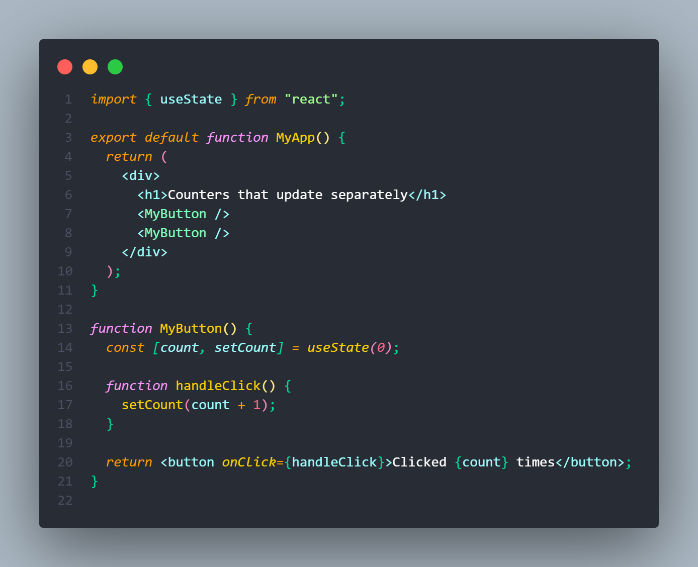
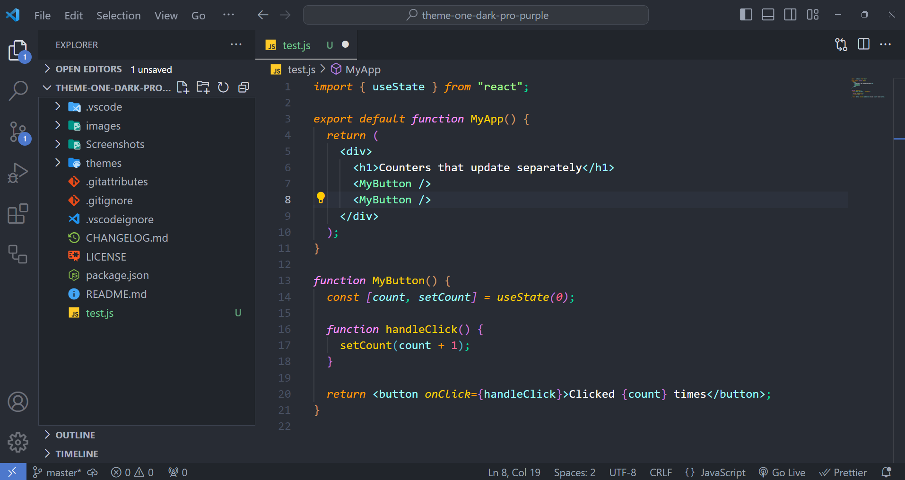

# [One Dark Pro Purple](https://marketplace.visualstudio.com/items?itemName=yaoyuanzhang.theme-one-dark-pro-purple)

A Visual Studio Code theme that mashes the best of [One Dark Pro](https://marketplace.visualstudio.com/items?itemName=zhuangtongfa.Material-theme) and [Shades of Purple](https://marketplace.visualstudio.com/items?itemName=ahmadawais.shades-of-purple) together.

## Screenshots

## Installation

Preferences:

1. Go to `Extensions`
2. Search for `One Dark Pro Purple` and install it.
3. Go to `Color Themes` and choose `One Dark Pro Purple Syntax` as the color theme or `CMD + Shift + P` and enter Command `> color theme` and choose `One Dark Pro Purple Syntax`.

## License

[MIT](https://github.com/yyz945947732/vscode-theme-one-dark-pro-purple/blob/master/LICENSE)
